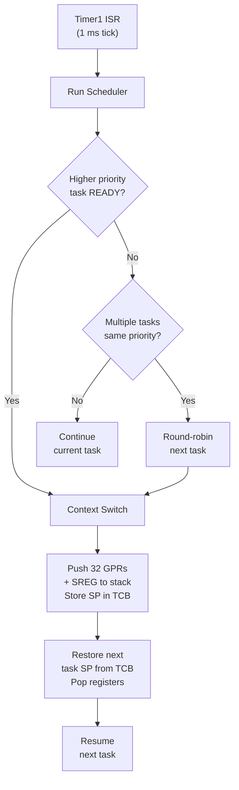
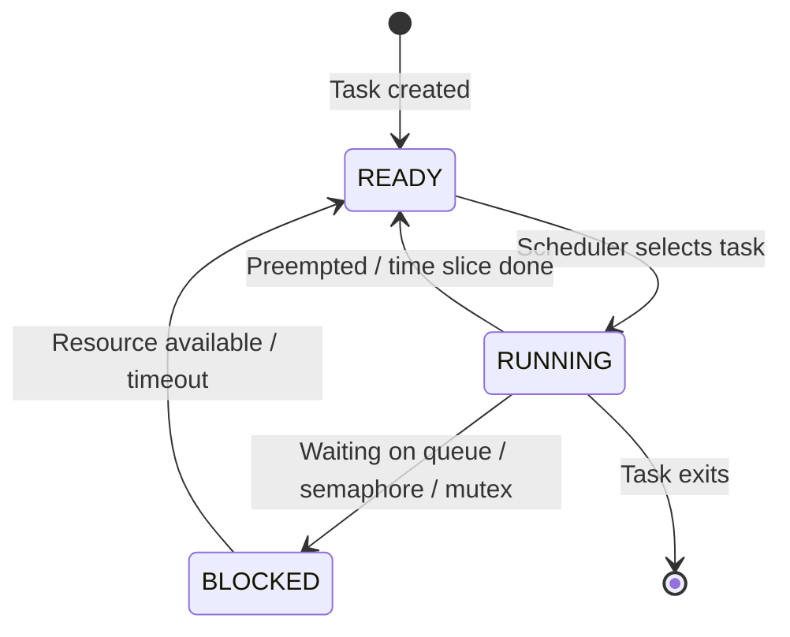

# ThebeRTOS-AVR
 
A preemptive RTOS built from scratch for the ATmega328P.
 
Written in C and AVR assembly. No dynamic memory. No external libraries.
 
---
 
## What it does
 
- 1 ms system tick via Timer1 drives preemptive scheduling
- Priority-based scheduler with round-robin tiebreaking
- Full context switch in assembly — all 32 GPRs + SREG saved per task
- Static memory only — no `malloc`, no heap fragmentation
- Inter-task communication via message queues, semaphores, and mutexes
- Stack usage monitoring using a known fill pattern (`0xAA`)
---
 
## Scheduler
 

 
---
 
## Task States
 

 
---
 
## Memory Model
 
Each task gets a statically allocated stack at compile time. No dynamic allocation anywhere in the kernel.
 
```
Task Control Block (TCB)
┌─────────────────────┐
│  Stack Pointer (SP) │  ← saved on context switch
│  Priority           │
│  State              │  READY / RUNNING / BLOCKED
│  Stack Base Ptr     │
│  Stack Size         │
└─────────────────────┘
 
Task Stack (static)
┌────────────────────────────────┐
│ 0xAA 0xAA 0xAA ... (canary)   │  ← fill pattern for usage tracking
│ ...                            │
│ R0–R31, SREG (saved context)  │  ← grows downward
└────────────────────────────────┘
```
 
---
 
## IPC Primitives
 
| Primitive | Implementation | ISR-safe |
|---|---|---|
| Message Queue | Circular buffer, copy-by-value | ✓ |
| Binary Semaphore | Flag + blocked task list | ✓ |
| Mutex | Binary + priority inheritance | ✗ |
| Software Timer | Tick-based callback, one-shot or periodic | ✓ |
 
**Priority inheritance on mutexes** — if a high-priority task blocks on a mutex held by a lower-priority task, the holder's priority is temporarily raised to prevent inversion.
 
---
 
## Project Structure
 
```
ThebeRTOS-avr/
├── include/
│   ├── kernel.h        # Public API — task creation, IPC, timers
│   └── hal.h           # Hardware abstraction declarations
├── src/
│   ├── kernel/
│   │   ├── scheduler.c # Task selection, round-robin logic
│   │   ├── task.c      # TCB management, stack init
│   │   ├── queue.c     # Message queue implementation
│   │   ├── semaphore.c # Binary semaphore
│   │   ├── mutex.c     # Mutex + priority inheritance
│   │   └── timer.c     # Software timers
│   ├── hal/
│   │   ├── timer_hal.c # Timer1 config and ISR
│   │   └── uart.c      # UART driver for diagnostics
│   └── main.c          # Demo application
└── Makefile
```
 
---
 
## Build & Flash
 
**Requirements:** `avr-gcc`, `make`, `avrdude`
 
```bash
make
make flash
```
 
Target: ATmega328P at 16 MHz. Edit `Makefile` to change MCU or programmer settings.
 
---
 
## Demo Output (UART @ 9600 baud)
 
The health monitor task reports task state and stack usage every 500 ms:
 
```
[ThebeRTOS] tick=1000
  Task 0 | RUNNING | stack used: 48/128 bytes
  Task 1 | BLOCKED | stack used: 32/128 bytes
  Task 2 | READY   | stack used: 24/128 bytes
```
 
---
 
## Why I built this
 
FreeRTOS exists. The point was to understand what's underneath it — how a context switch actually works at the register level on an 8-bit MCU, what it takes to build a scheduler with no OS underneath, and what constraints come from 2 KB of SRAM.
 
This project came out of studying AVR timer peripherals and UART before moving on to FreeRTOS on ESP32.
 
---
 
## Author
 
**Thebe Ledwaba**  
GitHub: [ThebeLedwaba](https://github.com/ThebeLedwaba) · Portfolio: [thebeledwabawebsite.netlify.app](https://thebeledwabawebsite.netlify.app)
